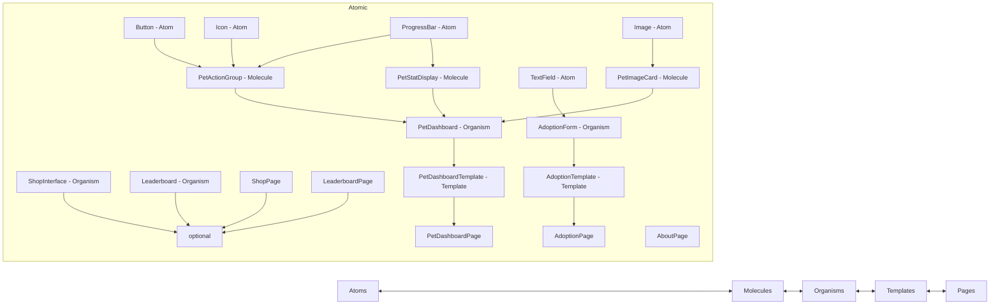

Below is the **Virtual Pet Simulator** front-end technical plan, following **atomic design principles** and structured to allow **10 AI software agents** (each acting as a front-end developer) to work in **parallel** with minimal interdependencies.

---

## 1. High-Level Front-End Overview

We’re building a **Virtual Pet Simulator** with Next.js. The core goal is to allow a user to adopt a pet, see and interact with it on a main “Pet Dashboard,” and keep track of stats like hunger, happiness, and energy levels over time.

Key pages/components:

1. **Adoption Page** – Users choose a pet type (dog, cat, or a fantasy creature like a dragon) and name it.
2. **Pet Dashboard/Main Game Page** – The home screen after adoption, displaying:
   - Pet image
   - Stats (hunger, happiness, etc.)
   - Action buttons (Feed, Play, Clean, etc.)
   - Real-time or near-real-time updates to stats
3. **Pet Shop Page** _(Optional)_ – A place to “purchase” items or accessories for the pet.
4. **Stats/Leaderboard Page** _(Optional)_ – Show aggregated stats or rank user pets.
5. **About/Privacy Page** – Explains usage of data, disclaimers, or the dev’s story.

Since the **immediate MVP** focuses on a simpler flow (Adoption → Pet Dashboard → Stats Updates), we’ll concentrate on the core UI components, designed in **Storybook** using **atomic design** best practices. We’ll build:

- **Atoms**: Buttons, Icon, Progress Bars, etc.
- **Molecules**: PetStatDisplay, PetImageCard, PetActionGroup, etc.
- **Organisms**: PetDashboardOrganism, AdoptionFormOrganism, etc.
- **Templates** (optional layer before pages): Page layouts or complex compositions that will be combined for final pages.
- **Pages**: Using Next.js pages or storybook mock pages with final compositions.

We’ll maintain reusability by carefully splitting these components so that each developer can build them in parallel.

---

## 2. Component Dependency (Mermaid Diagram)

Below is a **Mermaid** diagram illustrating how the components depend on one another, following an atomic design approach:

### Explanation

1. **Atoms**:
   - Button, Icon, ProgressBar, TextField, Image
2. **Molecules**:
   - **PetStatDisplay** (combines ProgressBar for hunger/happiness + label)
   - **PetActionGroup** (a group of Button atoms + optional Icon)
   - **PetImageCard** (an Image + overlay text for pet name, or simple stylings)
3. **Organisms**:
   - **AdoptionForm** (TextField + Buttons + maybe a small Image preview)
   - **PetDashboard** (PetImageCard, PetStatDisplay, PetActionGroup)
   - (Optional) ShopInterface, Leaderboard
4. **Templates**:
   - **AdoptionTemplate** (AdoptionForm + layout with background, heading, etc.)
   - **PetDashboardTemplate** (PetDashboard + optional header, background)
5. **Pages**:
   - **AdoptionPage**
   - **PetDashboardPage**
   - (Optional) ShopPage, LeaderboardPage
   - **AboutPage**

---
